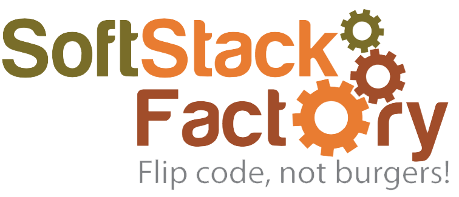

# Exploratory Data Analysis ( EDA ) - DS201 Fall 2019

Exploratory Data Analysis (EDA) is the first step in your data analysis 
process. Here, you make sense of the data you have and then figure out 
what questions you want to ask and how to frame them, as well as how 
best to manipulate your available data sources to get the answers you 
need.

This is part 2 of a 3-part program designed to be a introduction to data 
science and applied machine learning. If you're a developer, analyst, 
manager, or aspiring data scientist looking learn more about data 
science, then you're in the right place.

In this section you will cover the techniques that real life data 
scientists use to gain insight into a dataset. From data engineering to 
more advanced manipulation and visualizations; this program will show you 
how to unlock the secrets of any dataset — with the expressed goal of 
building experiments that require the building of a hypothesis function 
or “Model”.

## Day 1: Overview

{ CONTENT GOES HERE }

## Day 2: Introduction to Statistics 

Statistics is a field of mathematics that is universally agreed to be a 
prerequisite for a deeper understanding of machine learning.

Although statistics is a large field with many esoteric theories and 
findings, the nuts and bolts tools and notations taken from the field 
are required for machine learning practitioners. With a solid foundation 
of what statistics is, it is possible to focus on just the good or 
relevant parts.

In this section of the course, you will discover how you can get started 
and confidently read and implement statistical methods used in machine 
learning with Python.

## Day 3: Data Cleaning

Proper data cleaning is the “secret” sauce behind machine learning… 
Well, it’s not really a “secret”… It’s just a bit boring, so no one 
really talks about it. But the truth is:
- <strong>Better data beats fancier algorithms</strong>
    - Even if you forget everything else from this program, please 
    remember this point
- <strong>Garbage in = Garbage out</strong>
    - Plain and Simple! If you have a clean dataset, even simple 
    algorithms can learn impressive insights from it!

Now, as you might imagine, different problems will require different 
methods. For now though, let’s at least ensure we know how to fix the 
most common issues. This section will give you a reliable starting 
point, regardless of your dataset.

## Day 4: Feature Engineering

To start, feature engineering is very open-ended. There are literally 
infinite options for new features to create. Plus, you’ll need domain 
knowledge to add informative features instead of more noise.

This is a skill that you’ll develop with time and practice, but 
heuristics will give you a head start. Heuristics help you know where to 
start looking, spark ideas, and get unstuck.

## Day 5: Data Visualizations & Graphing Libraries

In the Python world, there are multiple options for visualizing your 
data. Because of this variety, it can be really challenging to figure 
out which one to use when. This section covers some of the more popular 
ones and illustrates how to use them to create a simple charts.

Our goal for this section is for you to be able to communicate insights 
and tell stories using data visualization.

## Day 6: Charts & Plotting

{ CONTENT GOES HERE }

## Day 7/8: Final Project

Final project where students are given a real world dataset. Students 
are expected to go through each of the steps covered on their own. On
the final day, each student will present what they found in the data
to the rest of the class.

This program was inspired by data science primers and blogs found on the 
internet.
 
 

Sponsored by <a href="www.softstackfactory.com" target="_blank">
<big>SoftStack Factory</big></a>
